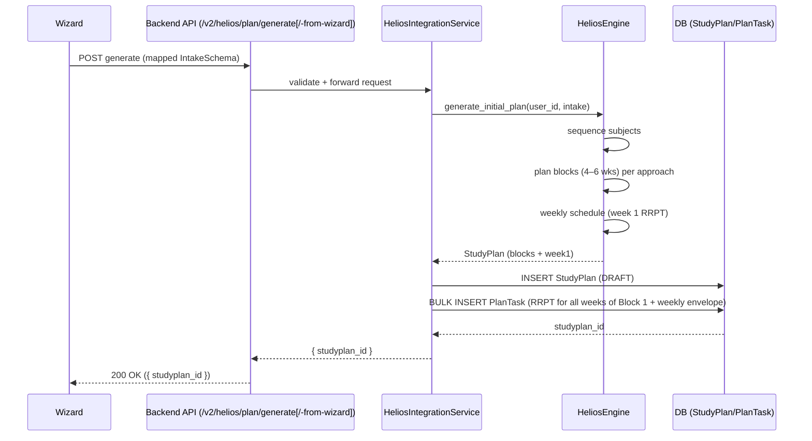

# End-to-End Flow: Wizard ➜ Plan Creation

## Overview

This document explains how a student’s intake submitted via the wizard becomes a persisted Study Plan with daily RRPT tasks for the first block.

## High-level Steps

1. Wizard Submit (Client)
   - The UI gathers the full intake (personal, background, subject confidence, study strategy).
   - Two integration options:
     - A) Client maps wizard -> engine intake and calls backend generate endpoint (current implementation). 
     - B) Backend accepts the raw wizard payload and adapts it (requires adding a new endpoint).

2. API Gateway (Backend)
   - Routes:
     - `POST /v2/helios/plan/generate` (mapped IntakeSchema)
     - `POST /v2/helios/plan/generate-from-wizard` (backend adapts wizard payload)
   - Module: `src/modules/helios/routes.py`
   - Auth: `CheckV2UserAccess` (roles: org_admin/branch_admin/teacher on admin app)

3. Service Orchestration
   - Function: `HeliosIntegrationService.generate_plan(...)` (file: `src/modules/helios/service.py`)
   - Adapts request `IntakeSchema` ➜ pure engine `StudentIntake`
   - Invokes the pure engine: `HeliosEngine.generate_initial_plan(user_id, intake)`

4. Core Engine Computation
   - Location: `src/helios/engine.py`
   - Subject Sequencing
     - Orders macro subjects using pacing (weak-first/strong-first) and self-assessments
     - Prefers subjects from the Subject Metadata Table to respect macro→micro ordering
   - Block Planning
     - Groups subjects per approach (single/dual/triple) into Blocks
     - Estimates block duration: baseline hours ±25% (very weak/strong), divided by weekly hours; clamp to 4–6 weeks
   - Weekly Scheduling (first block only)
     - Allocates weekly hours into RRPT (Study/Revision/Practice/Testing) via 50/20/15/15 (or overrides)
     - Splits Study/Revision/Practice across 6 days (Mon–Sat); Sunday is reserved for a Weekly Test and optional Weekly Review & Catch-up
   - Curated Resources
     - Pulls subject resource list for the current block
   - Returns an in-memory `StudyPlan` object with Blocks and the first block’s `WeeklyPlan`

5. Persistence (Backend)
   - Create `StudyPlan` row (status=DRAFT) tied to product/offering and creator
   - Emit RRPT `PlanTask` rows for every week in Block 1 (dates offset weekly)
     - `name` ← engine task title (e.g., “Study: New Topics”)
     - `planned_time` ← per-day minutes
     - `planned_completion_date` ← today + (day-1)
     - `task_type` mapping: Study→reading, Revision→revise, Practice→misc, Testing→test
     - `reference_materials` may include curated resources
   - Add weekly envelope tasks per week:
     - Catch-up Day (Sat)
     - Weekly Review (Mentor) + Weekly Self-Review (Student) (Sun)
     - Weekly Test (Sun)
   - Topics for the weekly test are fetched from CMS and split evenly across weeks; weekly topic IDs are attached to test tasks.
   - Practice and Test tasks include links per topic using `<practice_server_url>/<subject>/<topic>/practice` and `<test_server_url>/<subject>/<topic>/test`.
   - Bulk insert tasks
   - Return `{ studyplan_id }`

6. Consumption
   - Student/Mentor apps use existing teaching APIs to fetch plan/tasks
   - Daily check-ins (Telegram/web) update `PlanTaskUser` status (future integration)
   - Rebalancing endpoint exists as a placeholder; persistence of adjustments is planned

---

## Sequence (Mermaid)



---

## Example Request/Response

Request (mapped intake):
```json
{
  "user_id": 123,
  "product_id": 45,
  "offering_id": 67,
  "created_by_id": 999,
  "created_by_name": "Admin User",
  "intake": {
    "assessments": { "Polity": "weak", "Economy": "average", "History": "strong" },
    "weekly_study_hours": 30,
    "study_pacing": "weak_first",
    "study_approach": "dual_focus",
    "revision_ratio": null,
    "practice_ratio": null
  }
}
```

Response:
```json
{
  "success": true,
  "data": { "studyplan_id": 10101 }
}
```

---

## Notes & Options
- To accept the raw wizard payload on the backend, add a new endpoint (e.g., `/v2/helios/plan/generate-from-wizard`) that calls `HeliosEngine.generate_initial_plan_from_wizard(...)`.
- Only the first block has detailed daily tasks by design; future blocks stay high-level to allow rebalancing to adapt.
