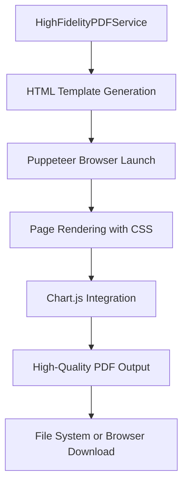

# High-Fidelity PDF Service Implementation

This document describes the implementation of the new `HighFidelityPDFService` that provides superior quality PDF generation using Puppeteer as an alternative to the existing jsPDF-based `PDFService`.

## Overview

The `HighFidelityPDFService` is a drop-in replacement for the existing `PDFService` with **exactly the same interface**, making it easy to swap between services based on your requirements.

### Key Features

✅ **Identical Interface**: Same API as the original PDFService for easy swapping  
✅ **Superior Quality**: Uses Puppeteer with native browser rendering for crisp text and graphics  
✅ **Modern Aesthetics**: Advanced CSS styling with gradients, shadows, and modern typography  
✅ **High-Fidelity Charts**: Native browser chart rendering instead of canvas-to-image conversion  
✅ **Precise Typography**: Better font rendering with antialiasing and subpixel positioning  
✅ **Professional Layout**: Enhanced spacing, colors, and visual hierarchy  
✅ **Full TypeScript Support**: Complete type safety and IntelliSense support  

## Usage

### Basic Usage

```typescript
import { HighFidelityPDFService } from 'helios-ts';

// Generate structured PDF (recommended for professional documents)
await HighFidelityPDFService.generateStructuredPDF(
  studyPlan, 
  studentIntake, 
  'professional-plan.pdf'
);

// Generate visual PDF (recommended for presentations)
await HighFidelityPDFService.generateVisualPDF(
  studyPlan, 
  studentIntake, 
  'presentation-plan.pdf'
);

// Use unified API
await HighFidelityPDFService.generateStudyPlanPDF(studyPlan, studentIntake, {
  type: 'structured',
  filename: 'my-plan.pdf'
});
```

### Easy Service Switching

```typescript
import { PDFService, HighFidelityPDFService } from 'helios-ts';

// Choose service based on requirements
const pdfService = useHighFidelity ? HighFidelityPDFService : PDFService;

// Both have identical interfaces!
await pdfService.generateStructuredPDF(studyPlan, studentIntake, 'plan.pdf');
```

### Service Comparison

| Feature | Original PDFService | HighFidelityPDFService |
|---------|-------------------|----------------------|
| **Speed** | ⚡ Fast | 🐌 Slower (due to browser launch) |
| **File Size** | 📦 Smaller | 📦 Larger (higher quality) |
| **Quality** | ✅ Good | ⭐ Excellent |
| **Typography** | ✅ Standard | ⭐ Premium with antialiasing |
| **Charts** | ✅ Canvas-based | ⭐ Native browser rendering |
| **Layout** | ✅ Table-based | ⭐ Modern CSS Grid/Flexbox |
| **Dependencies** | 📦 Lightweight (jsPDF) | 🔧 Heavier (Puppeteer) |
| **Browser Compatibility** | ✅ Works everywhere | 🚫 Node.js only |
| **Aesthetics** | ✅ Professional | ⭐ Modern & beautiful |

## API Reference

The `HighFidelityPDFService` provides the exact same methods as `PDFService`:

### `generateStructuredPDF(studyPlan, studentIntake, filename?)`
Generates a structured PDF that matches Word document format with enhanced visual quality.

### `generateVisualPDF(studyPlan, studentIntake, filename?)`
Generates a visual PDF with modern charts and enhanced design aesthetics.

### `generateStudyPlanPDF(studyPlan, studentIntake, options?)`
Unified API that accepts options for type and filename.

```typescript
interface Options {
  filename?: string;
  type?: 'structured' | 'visual';
}
```

## Technical Implementation

### Architecture



### Key Technologies

- **Puppeteer**: Headless Chrome automation for high-quality rendering
- **HTML/CSS**: Modern web standards for layout and styling
- **Chart.js**: Professional chart rendering with native browser support
- **Inter Font**: Modern typography with excellent readability
- **CSS Grid/Flexbox**: Responsive and precise layout control

### Quality Enhancements

1. **Typography**: Inter font family with antialiasing and subpixel rendering
2. **Colors**: Carefully chosen color palette with proper contrast ratios
3. **Spacing**: Consistent spacing system using CSS custom properties
4. **Charts**: Native Chart.js rendering instead of canvas-to-image conversion
5. **Layout**: CSS Grid and Flexbox for precise positioning
6. **Shadows**: Subtle drop shadows for depth and visual hierarchy
7. **Gradients**: Modern gradient backgrounds for visual appeal

## Performance Considerations

### When to Use High-Fidelity Service

✅ **Use for:**
- Client presentations and reports
- Marketing materials
- Premium document exports
- When visual quality is paramount
- Desktop/server applications

❌ **Consider Original Service for:**
- High-volume batch processing
- Web applications with tight performance requirements
- Mobile applications with limited resources
- When file size is critical

### Optimization Tips

```typescript
// For better performance in production
const browser = await puppeteer.launch({
  headless: true,
  args: [
    '--no-sandbox',
    '--disable-setuid-sandbox',
    '--disable-dev-shm-usage'
  ]
});
```

## Environment Setup

### Dependencies

```json
{
  "dependencies": {
    "puppeteer": "^24.0.0",
    "dayjs": "^1.11.18"
  }
}
```

### System Requirements

- **Node.js**: 18+ (for Puppeteer support)
- **Chrome/Chromium**: Automatically installed by Puppeteer
- **Memory**: Recommended 2GB+ available RAM
- **Storage**: Additional space for Chrome installation

### Docker Considerations

```dockerfile
# Install Chrome dependencies
RUN apt-get update && apt-get install -y \
    chromium-browser \
    fonts-liberation \
    --no-install-recommends

# Set Chrome path
ENV CHROME_PATH=/usr/bin/chromium-browser
```

## Error Handling

The service includes comprehensive error handling:

```typescript
try {
  await HighFidelityPDFService.generateStructuredPDF(plan, intake);
} catch (error) {
  if (error.message.includes('Chrome not found')) {
    // Fallback to original service
    await PDFService.generateStructuredPDF(plan, intake);
  }
}
```

## Migration Guide

### From Original PDFService

```typescript
// Before
import { PDFService } from 'helios-ts';
await PDFService.generateStructuredPDF(plan, intake);

// After - just change the import!
import { HighFidelityPDFService } from 'helios-ts';
await HighFidelityPDFService.generateStructuredPDF(plan, intake);
```

### Gradual Migration

```typescript
// Use environment variable to control service
const useHighFidelity = process.env.USE_HIGH_FIDELITY_PDF === 'true';
const pdfService = useHighFidelity ? HighFidelityPDFService : PDFService;

await pdfService.generateStructuredPDF(plan, intake);
```

## Troubleshooting

### Common Issues

**Chrome Launch Errors:**
```bash
# Install Chrome dependencies on Linux
apt-get install -y chromium-browser fonts-liberation
```

**Memory Issues:**
```javascript
// Increase Node.js memory limit
node --max-old-space-size=4096 your-script.js
```

**Permission Errors:**
```javascript
// Add sandbox bypass for containers
puppeteer.launch({
  args: ['--no-sandbox', '--disable-setuid-sandbox']
});
```

## Examples

See `examples/pdf-generation-demo.ts` for comprehensive usage examples including:

- Service comparison
- Performance testing
- Error handling
- Easy switching between services

## Future Enhancements

Planned improvements:

- [ ] PDF/A compliance for archival quality
- [ ] Custom branding and theming support
- [ ] Batch processing optimizations
- [ ] Progressive PDF generation for large documents
- [ ] WebP image optimization
- [ ] Accessibility (PDF/UA) compliance

---

**Note**: The high-fidelity service requires a Node.js environment and is not suitable for browser-based applications. For browser compatibility, use the original `PDFService`.